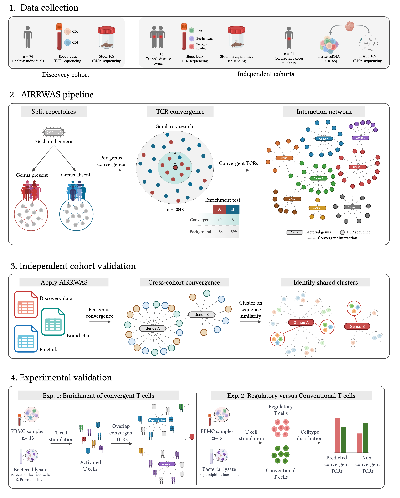

# AIRRWAS
Analysis pipeline associated with manuscript "T cell-microbiome associations captured through T cell receptor convergence analysis"

---

## Repository Structure

- **0_scripts/**  
  Contains all scripts used for the analysis.  
  - **utils/** within `0_scripts` holds helper functions required by the main scripts.  

- **test_data/**  
  For testing purposes, a small dataset of **6 samples** from the discovery cohort is provided.  
  This allows users to test the main parts of the pipeline without requiring access to the full dataset.  
  To run the full pipeline look at the data availability statement for full datasets.
  
- **TCR_microbiome_network.html**  
  The html file containing the full public TCR-microbiome interaction network.
  Download and open the file as a webpage to explore the interactive network.
   
---

## Data Availability

- **Discovery cohort**: Sequencing data have been deposited at [https://github.com/fabio-affaticati/activ_covid-tcell-omics](https://github.com/fabio-affaticati/activ_covid-tcell-omics).  
- **Validation experiments**: Experimental data generated during this study will be deposited on **Zenodo** and made publicly available upon acceptance of the manuscript.  

**Independent cohorts used for validation**:  
1. **IBD twins study**:  
   - Microbiome metagenomics data: [Brand et al., Gastroenterology (DOI: 10.1053/j.gastro.2021.01.030)](https://doi.org/10.1053/j.gastro.2021.01.030)  
   - TCR sequencing data: Brand et al. (in preparation)  

2. **Colorectal cancer single-cell dataset**:  
   - Microbiome data: not publicly available at this time.  
   - TCR sequencing data: Pu et al. (in preparation)  

All code and analysis scripts developed for this study will be made publicly available upon acceptance of the manuscript at:  
[https://github.com/RomiVandoren/AIRRWAS](https://github.com/RomiVandoren/AIRRWAS)  

---

## Contact
For questions regarding the code or data, please contact the authors of the manuscript.  

